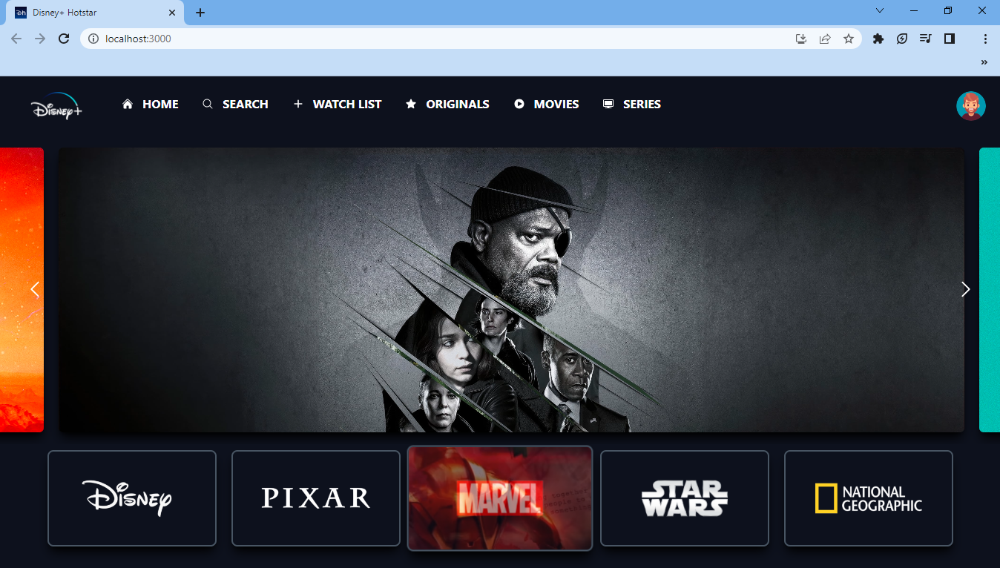
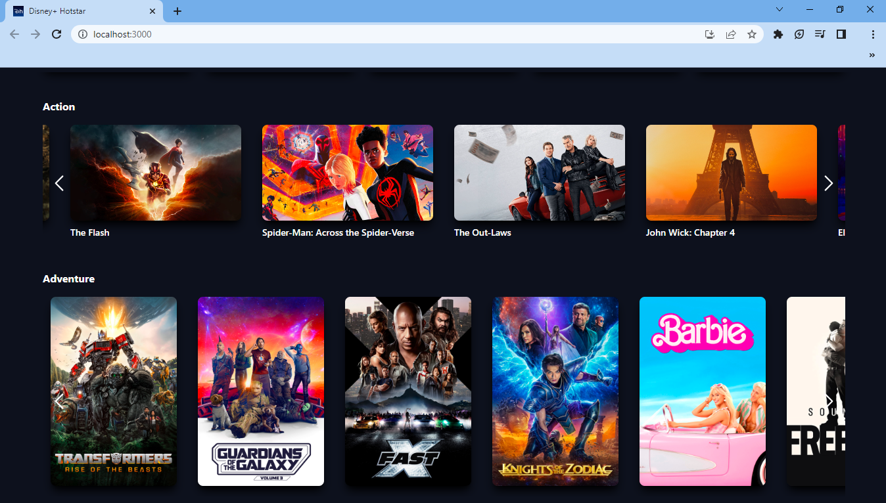

# Disney+ Clone with React and Tailwind CSS




This project is a Full Stack Disney+ clone built using React.js and Tailwind CSS. It allows users to browse trending movies and discover movies by genre using data from the [The Movie Database (TMDb) API](https://www.themoviedb.org/). The application provides a user-friendly interface similar to the Disney+ streaming platform.


- Browse trending movies and TV shows.
- Discover movies by genre.
- Responsive design for various screen sizes.
- User-friendly interface inspired by Disney+.


### Installation
1. Clone the repository:
   ```sh
   git clone https://github.com/G-nizam-A/Disney-Plus-Hotstar-Clone.git

2. Navigate to the project directory:
   ```sh
   cd disney-plus-hotstar-clone

3. Install dependencies:
   ```sh
   npm install

## Usage
1. Start the development server:
   ```sh
   npm start

2. Open your web browser and go to http://localhost:3000 to access the Weather App

## Technologies Used

- React.js
- Tailwind CSS
- Axios

## API Integration

The application uses the [Movie Database (TMDb) API](https://www.themoviedb.org/) to fetch movie data. The API requests are handled using the provided GlobalApi.js module. Trending movies and movies by genre can be accessed through the following methods:
```javascript
//GlobalApi.js
import axios from 'axios';
                      
const movieBaseUrl = "https://api.themoviedb.org/3"
const api_key = 'your-api-key'
```
Remember to replace 'your-api-key' with your actual TMDb API key in GlobalApi.js file.

## Contributing

Contributions to this project are welcome! Feel free to open issues and submit pull requests for any improvements, bug fixes, or new featu


